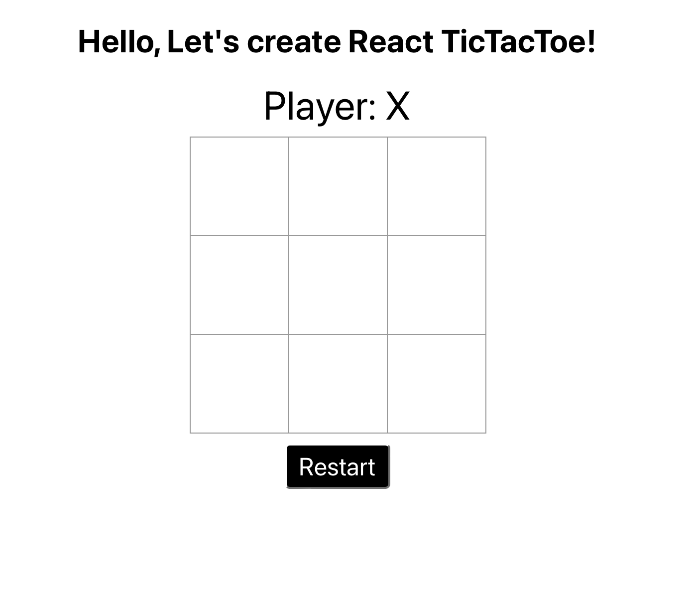
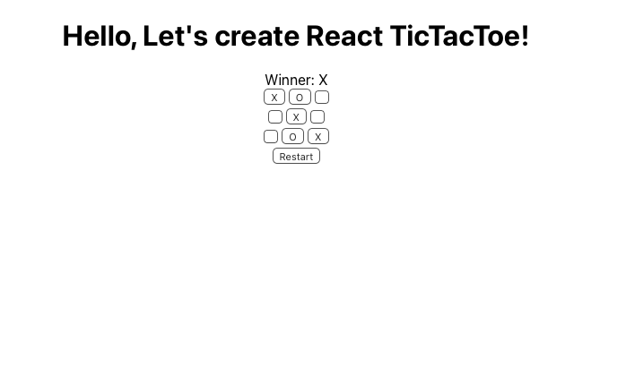

# Week 15 - React TicTacToe Checkpoint

<!-- REPLACE WITH MY OWN IMAGE -->



---

- [Week 15 - React TicTacToe CP](#week-15---react-tictactoe-checkpoint)

  - [Reminder](#reminder)
  - [Background](#background)
  - [Learning Objectives](#learning-objectives)
  - [Glossary](#glossary)
  - [What is React?](#what-is-react)
  - [Getting Started with React - TicTacToe App](#getting-started-with-react---tictactoe-app)
  - [Creating Our Directories](#creating-our-directories)
  - [Adding HTML](#adding-html)
  - [Confirguring Our Server](#confirguring-our-server)
  - [Adding Scripts](#adding-scripts)
  - [Connecting React To HTML](#connecting-react-to-html)
  - [Check for App Component](#check-for-app-component)
  - [Let Us Start Our App](#let-us-start-our-app)
  - [Let us build out our App](#let-us-build-out-our-app)
  - [Final Thoughts](#final-thoughts)
  - [Review](#review)

---

## Reminder

Please remember to start recording the RI session BEFORE the session begins. The check-in question
should be present in the recording. Remind students that they are being recorded.

---

## Background

The students should be familiar with Javscript, React, and React-Hooks.

---

## Learning Objectives

By the end of this session, learners will be able to:

- Create and use React Components
- Use React Hooks: UseState
- Utilize `UseState` as a lifecycle function

---

## Glossary

- `React Hooks`: Hooks are functions that let you “hook into” React state and lifecycle features from function components.

- `useState`: The useState() is a Hook that allows you to have state variables in functional components. In it's simpliest terms, useState is the ability to encapsulate local state in a functional component.

- `package.json`: It contains basic information about the project.

- `package-lock.json`: It describes the exact tree, from your local machine, that was generated to allow subsequent installs to have the identical tree.

---

## What is React?

React is a free and open-source front-end JavaScript library for building user interfaces based on UI
components. It was created by Facebook and is maintained by Meta and a community of individual developers
and companies. React can be used as a base in the development of single-page or mobile applications.

---

## Getting Started with React - TicTacToe App

Let's create a directory. We'll call this directory `React TicTacToe App`:

```bash
  $ mkdir React-TicTacToe-App
  // React-TicTacToe-App
```

In the project directory, let's start by initiating a package.json file:

```bash
  $ npm init -y
  // name, version, description, main, scripts, keywords, author, license
```

This will created a file called package.json and populate this file with the documentation the server
needs for development. The `-y` flag auto populate your `package.json` file with the following information:

```json
{
  "name": "react-tictactoe-app",

  "version": "1.0.0",

  "description": "",

  "main": "index.js",

  "scripts": {
    "test": "echo \"Error: no test specified\" && exit 1"
  },

  "keywords": [],

  "author": "",

  "license": "ISC"
}
```

---

## Creating Our Directories

Next, open a terminal and navigate to the project's root directory. We're going to create two new
directories `client` and `server`:

```bash
  mkdir client server
```

Here, we are splitting our project in half: `client` will contain everything on the front-end, and
`server` will contain everything needed for the back-end. This is a common setup for professional
projects because there are almost always different people working on the front/back-end code, and it
helps to cleanly delineate between responsibilities.

Now let's configure our new `client` directory to use React:

```bash
  cd client
  touch index.html
```

---

## Adding HTML

In the `index.html` is just our boilerplate skeleton, with a `<div></div>` including an ID of `#root`
that we will use specifically to display our Components to our GUI (Graphical User Interface):

```html
<!DOCTYPE html>
<html lang="en">
  <head>
    <meta charset="utf-8" />
    <meta http-equiv="X-UA-Compatible" content="IE=edge" />
    <meta name="viewport" content="width=device-width, initial-scale=1" />

    <title>React App</title>
  </head>
  <body>
    <noscript>You need to enable JavaScript to run this app.</noscript>
    <div id="root"></div>
    <!--
      This HTML file is a template.
      If you open it directly in the browser, you will see an empty page.
    -->
  </body>
</html>
```

That is it for our `HTML` file. We are simply creating a div called `root` and rendering the content.

---

## Confirguring Our Server

Now let's configure our new `server` directory to use React:

```bash
  cd ../server

  mkdir Components Components/App Components/Board Components/Game Components/LocalStorage Components/Winners 

  cd Components

  touch index.js index.css App/App.jsx Board/Board.jsx Game/Game.jsx LocalStorage/LocalStorage.jsx Winners/Winners.jsx

  npm install axios cors react react-dom react-scripts
  
  npm install --save-dev nodemon -g
```

> `Consider This`  
> What did we do here?
>> Created a Components directory, the created App, Board, Game, LocalStorage, and Winners directories
within the Components directory.
>> Created index.js index.css APP, BOARD, GAME, LOCALSTORAGE, AND WINNERS files within the Components
director.
>> Installed `axios cors react react-dom react-scripts` dependencies.
>> Installed `nodemon` dependencies.

---

## Adding Scripts

Now we need to add scripts to the `package.json` scripts section to look like this:

```json
  "scripts": {
    "start": "react-scripts start",
    "run": "nodemon index.js"
  },
```

> `Consider This`
> What do you think that the `react-scripts` does here?
>> The script generates the required files and folders to start the React application and run it on the browser.
This allows you to focus on coding your application without having to bother with build configurations.

---

## Connecting React To HTML

Before starting our app, let's connect our React Components to our `HTML` page:

```js
import React from 'react';
import { createRoot } from 'react-dom/client';

import './index.css';
import App from './App';

const root = createRoot(document.getElementById('root'));

root.render(
  <React.StrictMode>
    <App />
  </React.StrictMode>
);
```

Here, we are importing our core dependencies `React` and `{ createRoot }` from `react-dom/client`.
`Reactdom.Render` is no longer supported in React 18. We will use `createroot` instead.

We are also importing our `global CSS` and our App Component that will render our GUI.
Last but not least, `createRoot` allows content to be rendered to the HTML page.

> `Consider This`  
> What is `<React.StrictMode></React.StrictMode>` for?
>> StrictMode is a React Developer Tool that is primarily used to identify potential issues in a web
application. For its descendant components, it activates additional deprecation checks and warnings.

---

## Check For App Component

Next, in `src/Components/App.jsx`, let's check for content on the Page. Let's create a function called App
and populate this Component with `Hello, Let's create React TicTacToe!`.

```js
import React from 'react';
import './App.css';

function App() {
  return (
    <div className="App">
      Hello, Let's create React TicTacToe!
    </div>
  );
}

export default App;
```

---

## Let Us Start Our App

Now let's get our react app up and running by navigating to the terminal and running:

> `npm start`

`npm start` runs the app in the development mode.\
Open [http://localhost:3000](http://localhost:3000) to view it in your browser.

At this point you should see the message `Hello, Let's create React TicTacToe!` in your browser.

- The page will reload when you make changes.
- You may also see any lint errors in the console.

---

## Let Us Build Out Our App

<details closed>
<summary> Creating Winners Components </summary>
<br>
First in `src/Components/Winners/Winners.jsx`, let's create a function called Winners to grab the `Winning`
formulas from an array.

```js
// WINNERS FUNCTION TO DECLARE WINNER
function Winners(squares, line) {

  // CREATE AND STORE A PATTERN OF WINNING COMBINATIONS
  const lines = [
    [0, 1, 2],
    [3, 4, 5],
    [6, 7, 8],
    [0, 3, 6],
    [1, 4, 7],
    [2, 5, 8],
    [0, 4, 8],
    [2, 4, 6],
  ];

  // (for in) LOOPS THROUGH THE ARRAY TO FIND THE WINNING COMBINATION
  for (line in lines) {
    const [col_1, col_2, col_3] = lines[line];

    // CONSOLE LOG TO SEE THE WINNING COMBINATION OF NUMBERS
    console.table(lines[line]);

    // IF THIS CONDITION IS TRUE, DECLARE A WINNER!!!
    if (squares[col_1] && 
        // IF COL_1 IS TRUE

        squares[col_1] === squares[col_2] &&
        // AND COL_1 IS STRICTLY EQUAL TO COL_2

        squares[col_1] === squares[col_3])
        // AND COL_1 IS STRICTLY EQUAL TO COL_3
        
        {
      return squares[col_1];
      // RETURN THE WINNING COMBINATION
    }
  }

  return undefined;
  // ELSE RETURN NOTHING AND CONTINUE
}

// EXPORT ALLOWS THIS FUNCTIONAL COMPONENT TO BE UTILIZED BY OTHER REACT COMPONENTS
export default Winners;
```

Here, we are storing winning formulas in case of a winner in each lines array and if the computer loop
through any any of those patterns, it will declare the winner.

</details>

---

<details closed>
<summary> Creating NextPlayer Component </summary>
<br>

The `NextPlayer` function uses a filter to alternate between Boolean values ( True/False ).
It then uses their `length`, `modulus`, and the `ternary operator` to determine who goes next.

```js
// NEXT PLAYER FUNCTION IS USED TO DETERMINE THE NEXT PLAYER TURN
function NextPlayer(squares) {

  return squares.filter(Boolean).length % 2 === 0 ? "X" : "O";
  // PLAYER 1 CLICKS ON A SQUARE AND THEY ARE DECLARED "X", THEN PLAYER 2 PICK A SQUARE AND IS DECLARED "O".

}

export default NextPlayer;
// EXPORT ALLOWS THIS FUNCTIONAL COMPONENT TO BE UTILIZED BY OTHER REACT COMPONENTS
```

</details>

---

<details closed>
<summary> Creating KeepScore Component </summary>
<br>

The `KeepScore` function returns the "Winner", and displays who won: "X's", "O's", or a "TIE". It does this
by a blind conditional statement that returns the winner if all conditions are met OR continue. When a winner
Combo has been detected, it will execute whether there is a "TIE" or "Player: X" or "Player: O".

```js
function KeepScore(winner, squares, next) {

  return winner
    ?
      `Winner: ${winner}`
      // IF THERE IS A WINNER (TRUE), DISPLAY WINNER: "X's" OR "O's"

    : squares.every(Boolean)
      // IF NO WINNER, CONTINUE
      
      ? 'Tie: Play again!'
      // ELSE-IF TIE, SAY "TIE: PLAY AGAIN!"
      
      
    : `Player: ${next}`;
    // ELSE NEXT PLAYER CONTINUE
}

export default KeepScore
// EXPORT ALLOWS THIS FUNCTIONAL COMPONENT TO BE UTILIZED BY OTHER REACT COMPONENTS
```

</details>

---

<details closed>
<summary> Creating GameBoard Component </summary>
<br>

## Creating Our GameBoard

Now let's create our game-board in `GameBoard.jsx`.

We are using `useState` to create an array with 9 empty slots, then filling those slots with `undefined`.
The counter/index will start at `0` ( default ) and continue to update the count to the last index
( default array.length ).

```js
import React, { useState } from "react";
// IMPORTING REACT TO BE ABLE TO USE ALL COMPONENTS ACROSS APPLICATION

import Winners from "../Winners/Winners";
import NextPlayer from "../NextPlayer/NextPlayer";
import KeepScore from "../KeepScore/KeepScore";
// IMPORT COMPONENTS AND USING THEM TO THE FUNCTIONAL BOARD

// CREATING A BOARD FUNCTIONAL COMPONENT
function GameBoard() {

  const [squares, setSquares] = useState(Array(9).fill(undefined));

  const nextValue = NextPlayer(squares);
  const winner = Winners(squares);
  const score = KeepScore(winner, squares, nextValue);
  // CONVERTING FUNCTIONAL COMPONENTS TO SINGLE VARIABLE VALUES

  // SELECT SQUARE FUNCTION
  function selectSquare(square) {

    if (winner || squares[square]) {
    // IF WINNER FUNCTION IS TRUE, OR ANY WINNING COMBINATION IS TRUE...

      return;
      // RETURN WINNER
    }
    const squaresCopy = [...squares];
    squaresCopy[square] = nextValue;
    setSquares(squaresCopy);
    // CONTINUE TO THE NEXT PLAYER TO PICK THEIR SQUARE USING `setSquares` FUNCTION
  }

  // RESTART FUNCTION
  function restart() {

    setSquares(Array(9).fill(undefined));
    // WE ARE CREATING AN ARRAY WITH 9 EMPTY SLOTS, FILLING THOSE SLOTS WITH THE undefined VALUE - FROM A START INDEX (default 0) TO AN END INDEX (default array.length)

  }

  // REACT EVENT LISTENER THAT ALLOWS EACH SQUARE TO BE CLICKED
  function renderSquare(i) {
    return (
      <button className="square" onClick={() => selectSquare(i)}>
        {squares[i]}
      </button>
    );
  }

  return (
    <div>
      {/* IMPORTING THE COMPONENT KEEP SCORE AND IT'S ELEMENTS */}
      <div className="score">{score}</div>

      {/* CREATES THE BOARD BY MAKING 3 ROWS AND 3 COLUMNS, RENDERING BY INDEXING 0,1,2,3,4,5,6,7,8 */}
      <div className="board">
        <div className="board-row">
          {renderSquare(0)}
          {renderSquare(1)}
          {renderSquare(2)}
        </div>
        <div className="board-row">
          {renderSquare(3)}
          {renderSquare(4)}
          {renderSquare(5)}
        </div>
        <div className="board-row">
          {renderSquare(6)}
          {renderSquare(7)}
          {renderSquare(8)}
        </div>
      </div>

      {/* RESTARTS THE GAME OVER AT ANYTIME WITH OUR RESTART BUTTON */}
      <button className="restart" onClick={restart}>
        Restart
      </button>
    </div>
  );
}

export default GameBoard;
/// EXPORT ALLOWS THIS FUNCTIONAL COMPONENT TO BE UTILIZED BY OTHER REACT COMPONENTS
```

</details>

---

<details closed>
<summary> Adding Game Component To App </summary>
<br>

```js
import GameBoard from '../GameBoard/GameBoard'
// IMPORTS GAME BOARD AND ALL THE COMPONENTS THAT GAME BOARD EXPORTED FROM OTHER COMPONENTS

function App() {
  return (
    <div className="App">
      
      {/* DISPLAYS HEADING/TITLE TO PAGE */}
      <h1>Hello, Let's create React TicTacToe!</h1>

      {/* DISPLAYS THE GAME BOARD COMPONENT TO THE PAGE */}
      <GameBoard />
    </div>
  );
}

export default App
// EXPORT ALLOWS THIS FUNCTIONAL COMPONENT TO BE UTILIZED BY OTHER REACT COMPONENTS
```

</details>

---

Our TicTacToe Game should look like this without any CSS:



<details closed>
<summary> Adding Style to App.css </summary>
<br>

Now in `App.css` let's add some styles for our GameBoard:

```CSS
/* NEED TO REDO BOARD IN MY OWN STYLES AND CAPTURE IMAGE */
.game {
  font: 14px 'Century Gothic', Futura, sans-serif;
  margin: 20px;
  min-height: 260px;
}

.game ol,
.game ul {
  padding-left: 30px;
}

.board-row:after {
  clear: both;
  content: '';
  display: table;
}

.score {
  margin-bottom: 10px;
}

.restart {
  margin-top: 10px;
}

.square {
  background: #fff;
  border: 1px solid #999;
  float: left;
  font-size: 24px;
  font-weight: bold;
  line-height: 34px;
  height: 34px;
  margin-right: -1px;
  margin-top: -1px;
  padding: 0;
  text-align: center;
  width: 34px;
}

.square:focus {
  outline: none;
  background: #ddd;
}

.game {
  display: flex;
  flex-direction: row;
}

.game-info {
  margin-left: 20px;
  min-width: 190px;
}
```

Here, we just added some general styling to the board for visualization.

</details>

---

## Final Thoughts

The React `useState` Hook allows us to track state in a function component. State generally refers
to data or properties that need to be tracking in an application. The reason we use useState instead of
variable is because if you useState it re-renders the view. Variables by themselves can only
change bits in memory and the state of your app can get out of sync with the view. In both cases `state`
changes on click, but when you use useState the view correctly shows the current value.

The `useState` hook is used for storing variables that are part of your application's state and will
change as the user interacts with your website. `useState` is a Hook (function) that allows you to have
state variables in functional components. You pass the initial state to this function and it returns a
variable with the current state value (not necessarilythe initial state) and another function to update
this value.

---

## Review

Learners should be able to:

- Create and use React Components
- Use React Hook: `UseState`
- Utilize `UseState` to update the Web App to the cuurent state
